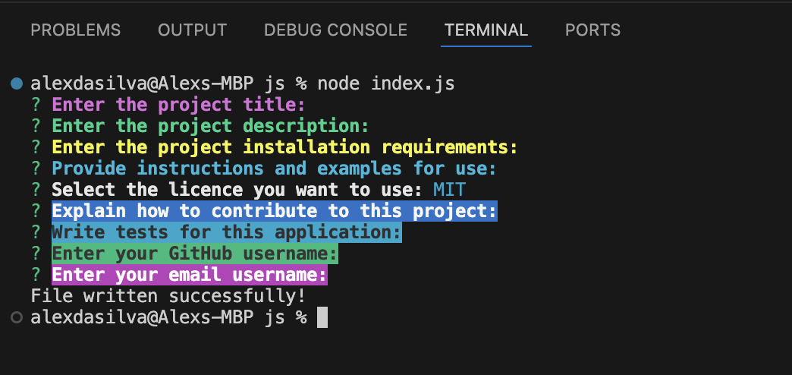
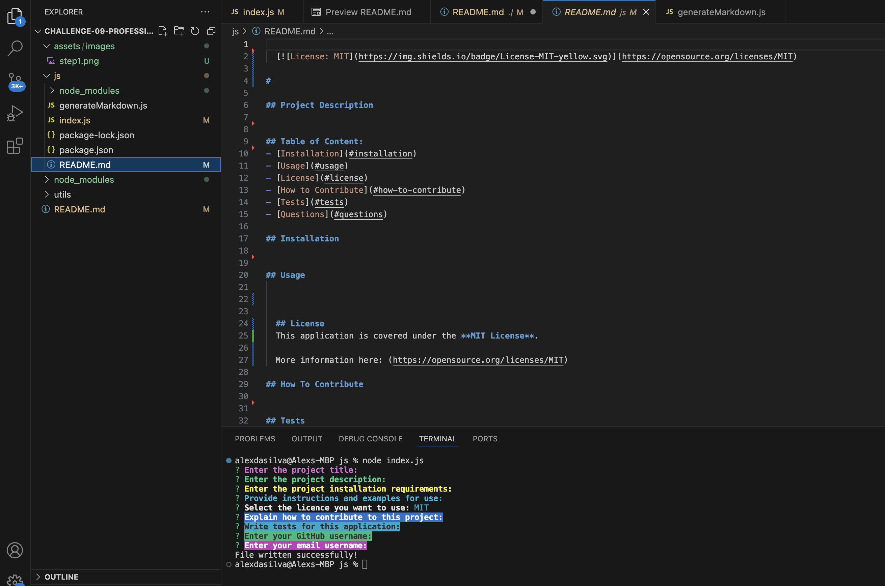
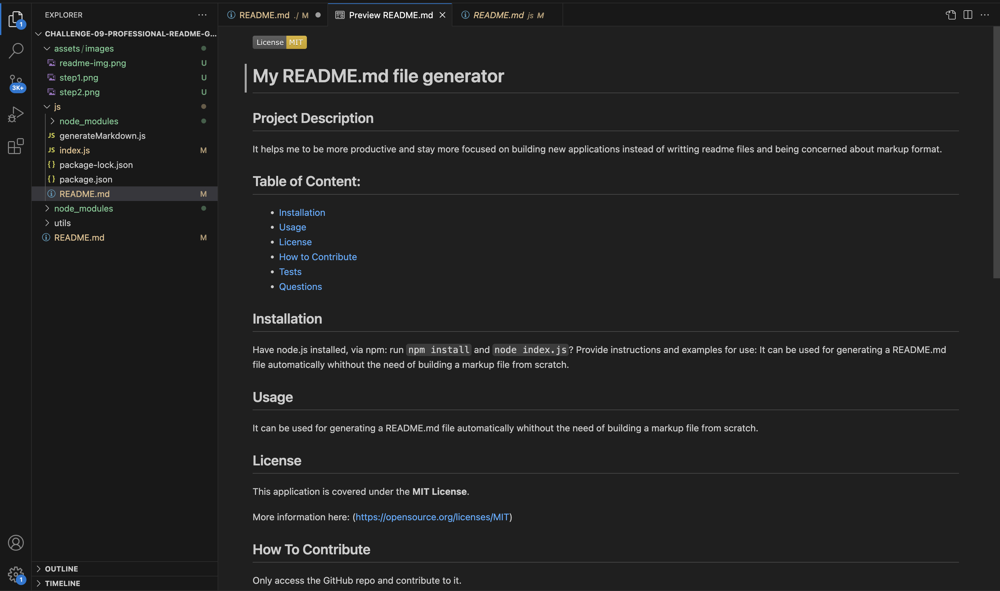

# Challenge 09: Professional README Generator

## Description

- My motivation for tbuilding this project is to make my life easier while creating README.md files for my projects.
- It helps me to be more productive and stay more focused on building new applications instead of writting readme files and being concerned about markup format.
- Learning:
  - I've learned specially how to create a README.md file dinamically while using `fs` and `inquirer` built-in module.
  - How to use `module.exports` to be used in another js file.
  - How to use node_modules, including it to my application.
  - How to install packages to my application and make it being installed automatically while calling a `init() function`.

## Table of Contents

- [Installation](#installation)
- [Usage](#usage)
- [Credits](#credits)
- [License](#license)

## Installation

After cloning the code to your machine you should:

Have `node.js` installed to your machine.

Via `npm`

- `npm install` to install all dependecies/pachages for this application.
- `node index.js` to run the application.

## Usage

After installing all node modules and start running the application, you should be able to:

### Answer those questions that will pronpt to the terminal: 👇👇👇

### Generate a README.md file automatically based on the answers provided to the prompt questions.

#### Generated README.md file example 👇👇👇

#### Preview of markup generated for the README.md file 👇👇👇

#### Watch here my video demo explaining the how to use it 👇👇👇

https://drive.google.com/file/d/1FS4fS2X1VawZqoRekRxyOv32EhaVCeDG/view?usp=sharing

## Credits and Stack

Node.Js (https://nodejs.org/en)

Check `package.json` for more information about dependencies and packages used for this project.

## How to Contribute and Questions

if you want to contribute or have any questions, here are my channels:
gitHub: https://github.com/Alex-Design-For-Reap/Challenge-09-Professional-README-Generator

email: s.alexsilva@gmail.com

Author: Alex Da Silva (https://alex-design-for-reap.github.io/Portfolio/)
